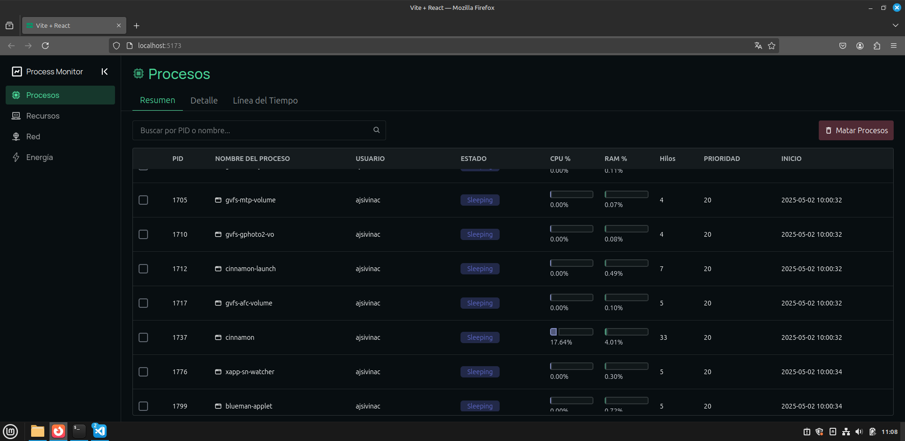
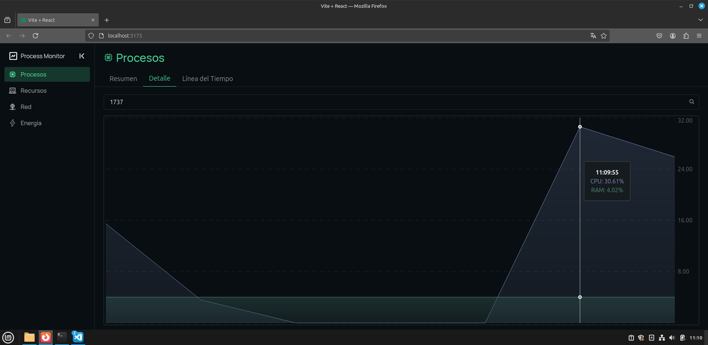
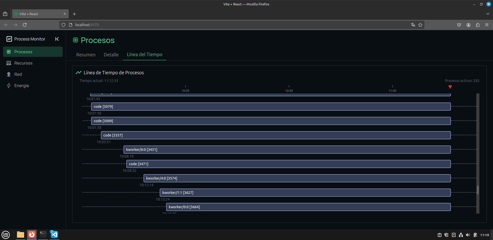
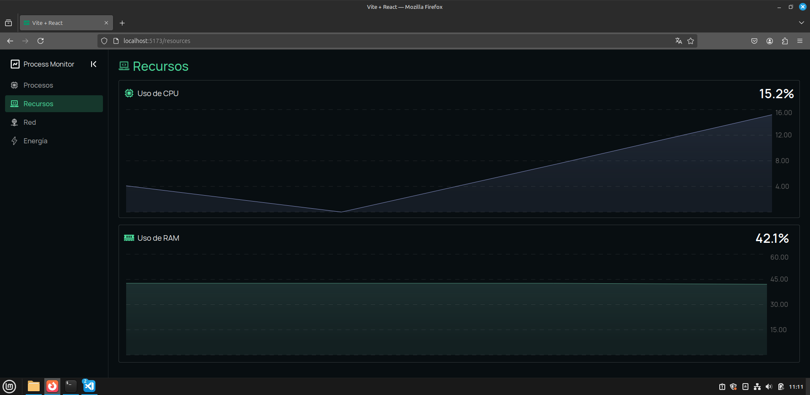
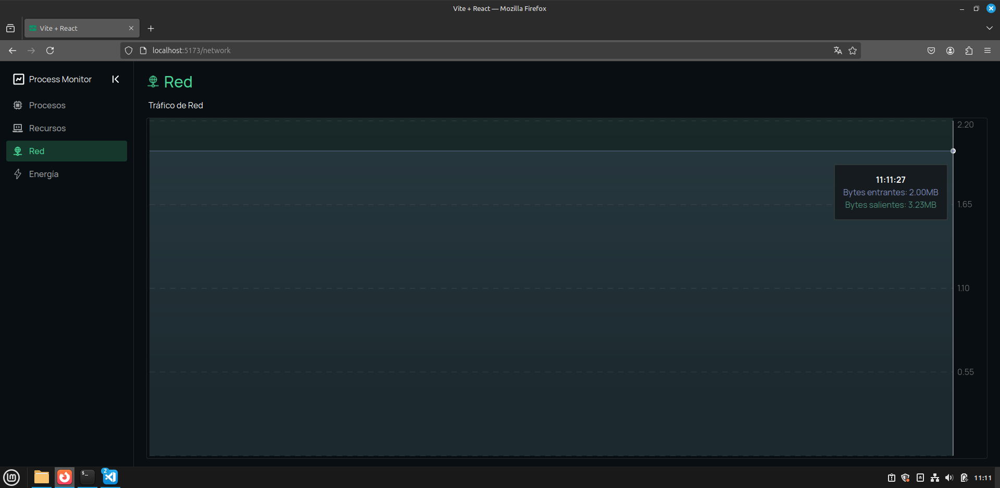

<h1 align="center">Proyecto</h1>

<div align="center">
    <p>📕 Sistemas Operativos 2</p>
    <p>📆 Mayo 2025 | 🏛 Universidad de San Carlos de Guatemala | 👤 Joab Ajsivinac</p>
</div>

---

> [!NOTE]  
> 🛠 **Tecnologías Utilizadas**
>
> <div align="center" style="display:flex;justify-content:center;gap:20px"></div>
>
> * Linux Kernel v6.12.17
> * c
> * React
> * Tailwindcss
> * Git

---

## 🎯 Objetivos

* 🛠️ Diseñar e implementar llamadas al sistema personalizadas para obtener información avanzada y en tiempo real de los procesos.
* 🖥️ Desarrollar una herramienta gráfica interactiva que permita gestionar procesos desde una interfaz web amigable.

---

## 📄 Descripción General

USAC Linux es una distribución ligera creada por estudiantes de la Universidad de San Carlos. Este proyecto contribuye a ella mediante la creación de un Administrador de Tareas moderno que supere a herramientas tradicionales como `top` o `htop`, añadiendo visualización, gestión y monitoreo en tiempo real.

---

## 🛠️ Configuración del Entorno

### 🧰 Herramientas Instaladas
Para compilar y modificar el kernel de Linux, se instalaron las siguientes herramientas en una distribución basada en Debian (Ubuntu/Linux Mint):
- **gcc**: Compilador de C.
- **make**: Herramienta para automatizar la compilación.
- **libncurses-dev**: Librería para la interfaz de menú de configuración del kernel.
- **flex**: Generador de analizadores léxicos.
- **bison**: Generador de analizadores sintácticos.
- **libssl-dev**: Librería para soporte de SSL.
- **git**: Sistema de control de versiones.

### 📂 Pasos para Configurar el Entorno
1. Actualizar el sistema:
   ```bash
   sudo apt update && sudo apt upgrade
   ```
2. Instalar las herramientas necesarias:
   ```bash
   $ sudo apt install build-essential libncurses-dev bison flex libssl-dev libelf-dev fakeroot dwarves
   ```

---

## 📥 Modificación del Kernel

> Se siguió utilizando el Kernel usado en la práctica no.1 (Kernel 6.12.17)

### Implementación de la Syscall
La syscall permitirá la sincronización bilateral de archivos entre dos directorios.

#### Definición de la syscall
La syscall recibirá las rutas de los dos directorios a sincronizar:
```c
SYSCALL_DEFINE2(real_time_sync, const char __user *, dir_path1, const char __user *, dir_path2)
```

#### Registro de la Syscall en el Kernel
2. Agregar la syscall en `arch/x86/entry/syscalls/syscall_64.tbl`:
   ```c
   555    common   sync_dirs     sys_sync_dirs
   ```
3. Implementar la syscall en `kernel/usac/practica2/syscall_1.c`:
   ```c
   SYSCALL_DEFINE2(sync_dirs, const char __user *, dir1, const char __user *, dir2) {

   }
   ```

---

## 🧩 Llamadas al Sistema Personalizadas

### 🔍 1. Lista detallada de procesos y búsqueda por PID

Este módulo del kernel de Linux define dos llamadas al sistema (`syscalls`) que permiten obtener métricas detalladas de los procesos activos en el sistema. Las métricas incluyen:

* PID, nombre del proceso, uso de CPU y RAM (%)
* Estado del proceso (ej. "Running", "Sleeping")
* Prioridad, UID, número de hilos
* Tiempo de inicio (`start_time`)

> 💡 Este sistema está diseñado para extender `top` o `htop` a través de una interfaz programática más detallada.

### 📦 Estructuras de Datos

#### `struct process_info`

Contiene la información recopilada de cada proceso.

```c
struct process_info {
    pid_t pid;
    char name[TASK_COMM_LEN];        // Nombre del proceso
    unsigned int cpu_percent;        // Uso de CPU en centésimas
    unsigned int ram_percent;        // Uso de RAM en centésimas
    int priority;
    char state_str[20];              // Estado legible
    long state;                      // Estado numérico
    uid_t uid;
    int num_threads;
    unsigned long start_time;
};
```

#### `struct process_list`

Define una lista de procesos para comunicación entre espacio kernel y usuario.

```c
struct process_list {
    int max_processes;               // Capacidad del arreglo en espacio de usuario
    int num_processes;               // Total de procesos cargados
    struct process_info *processes;  // Puntero a espacio de usuario
};
```

### 🔁 Cálculo de Uso de CPU

El cálculo de CPU se realiza midiendo el tiempo total (`utime + stime`) usado por un proceso y comparándolo con una muestra anterior. Se emplea un arreglo global sincronizado con `spin_lock`.

```c
static unsigned int calculate_cpu_percent(struct task_struct *task) {
    // ...
    delta_time = total_time - cpu_usage_array[i].last_total_time;
    delta_jiffies = current_jiffies - cpu_usage_array[i].last_update_jiffies;

    // Convertir jiffies a nanosegundos (simplificado para claridad)
    u64 jiffies_to_nsec = delta_jiffies * (100000000ULL / HZ);
    percent = div64_u64(delta_time * 10000ULL, jiffies_to_nsec);
    percent = div_u64(percent, num_cpus);
}
```

### 📉 Cálculo de Uso de RAM

Se basa en la cantidad de páginas RSS (Resident Set Size) y páginas en swap.

```c
static unsigned int calculate_ram_percent(struct task_struct *task) {
    // ...
    task_pages = get_mm_rss(mm) + get_mm_counter(mm, MM_SWAPENTS);
    percent = (unsigned int)((task_pages * 10000ULL) / total_pages);
}
```

---

### 💀 2. Kill / SIGCONT de procesos

#### 📋 Descripción General

La syscall `kill_control` es una versión personalizada y controlada de la llamada al sistema `kill`, que permite enviar **solo señales específicas** (`SIGKILL` o `SIGCONT`) a un proceso identificado por su PID.

Esto ofrece una forma segura de reiniciar o detener procesos de forma programática desde espacio de usuario, sin dar acceso total a todas las señales del sistema.

#### 📦 Encabezados Incluidos

```c
#include <linux/kernel.h>        // Funciones básicas del kernel
#include <linux/syscalls.h>      // Definición de SYSCALL_DEFINE
#include <linux/sched/signal.h>  // Manejo de procesos y señales
#include <linux/pid.h>           // Operaciones con PID
#include <linux/signal.h>        // Definiciones de señales
```

#### 🔧 Definición de la Syscall

```c
SYSCALL_DEFINE2(kill_control, pid_t, pid, int, signal)
```

Define una syscall con dos argumentos:

* `pid`: identificador del proceso objetivo.
* `signal`: señal que se desea enviar (`SIGKILL` o `SIGCONT`).

#### 🔍 Lógica Interna Paso a Paso

##### 1. Buscar el proceso por PID

```c
pid_struct = find_get_pid(pid);
if (!pid_struct)
    return -ESRCH;
```

Busca la estructura `pid` del proceso. Si no se encuentra, retorna `-ESRCH` (proceso inexistente).

##### 2. Obtener `task_struct`

```c
task = get_pid_task(pid_struct, PIDTYPE_PID);
if (!task)
    return -ESRCH;
```

Obtiene la estructura principal del proceso (`task_struct`). Si falla, retorna error.

##### 3. Validar la señal

```c
if (signal != SIGKILL && signal != SIGCONT)
    return -EINVAL;
```

Permite **solo dos señales**:

* `SIGKILL`: termina el proceso.
* `SIGCONT`: reanuda un proceso detenido.

> 🔐 Otras señales son rechazadas intencionalmente para limitar el poder destructivo.

##### 4. Enviar la señal

```c
ret = send_sig(signal, task, 0);
```

Envía la señal usando la función estándar `send_sig`.

##### 5. Liberar recursos

```c
put_task_struct(task);
```

Libera la referencia al `task_struct` para evitar fugas de memoria.

##### 6. Retornar resultado

```c
return ret;
```

Devuelve 0 si la señal fue enviada exitosamente, o un código de error.

---

### ⏱️ 3. Hora de inicio del proceso

#### 📘 Descripción General

La syscall `get_all_process_times` recopila información temporal de todos los procesos activos del sistema y devuelve una lista al espacio de usuario. Se incluyen:

* `PID` del proceso
* Nombre (`comm`)
* Tiempo de inicio (desde el arranque)
* Tiempo de finalización (si el proceso terminó, en segundos desde boot)

Esto resulta útil para **monitoreo, auditoría, profiling**, y herramientas de análisis de procesos en tiempo real.

#### 📂 Estructuras Involucradas

##### 🔹 `struct process_times`

Estructura que contiene los datos por proceso:

```c
struct process_times {
    pid_t pid;                     // Identificador del proceso
    char name[TASK_COMM_LEN];      // Nombre del proceso
    unsigned long start_time;      // En segundos desde el arranque
    unsigned long end_time;        // 0 si sigue activo
};
```

##### 🔹 `struct process_time_list`

Estructura principal de entrada/salida:

```c
struct process_time_list {
    int max_processes;                   // Tamaño máximo que puede recibir el buffer
    int num_processes;                   // Cantidad real escrita por el kernel
    struct process_times __user *times;  // Puntero al buffer de salida en espacio de usuario
};
```

#### 🔧 Definición de la Syscall

```c
SYSCALL_DEFINE1(get_all_process_times, struct process_time_list __user *, user_list)
```

Recibe un único parámetro apuntando a una estructura `process_time_list` en espacio de usuario, que debe tener:

* `max_processes` inicializado
* `times` apuntando a un buffer de tamaño adecuado

#### 🔎 Lógica Paso a Paso

##### 1. Validación y Preparación

* Se copia la estructura `process_time_list` del espacio de usuario.
* Se validan sus campos (`max_processes > 0`, buffer no nulo).

> ❌ En caso de error en la copia o valores inválidos, se retorna `-EINVAL` o `-EFAULT`.

##### 2. Conteo de procesos válidos

```c
for_each_process(task) {
    if (task->pid == 0) continue;
    count++;
}
```

Se recorre la lista global de procesos (`for_each_process`) y se descarta el proceso 0 (idle).

##### 3. Reservar Memoria Temporal

```c
buffer = kmalloc_array(count, sizeof(struct process_times), GFP_KERNEL);
```

Se asigna memoria dinámica en kernel space para almacenar los resultados temporales.

##### 4. Recolección de Datos

* Se vuelve a recorrer la lista de procesos.
* Se copia el PID, nombre, y tiempo de inicio.
* Si el proceso terminó (estado zombie o muerto), se marca el `end_time` con el tiempo actual desde boot (`ktime_get_boottime_seconds()`); si no, se pone 0.

> 🧠 Se protege el acceso a las estructuras del scheduler con `rcu_read_lock()` para evitar condiciones de carrera.

##### 5. Copia de Resultados a Usuario

* Se copia `num_processes` de vuelta al espacio de usuario con `put_user`.
* Luego se transfiere el arreglo completo con `copy_to_user`.

##### 6. Limpieza y Retorno

* Memoria liberada con `kfree`.
* Retorna 0 en caso de éxito, o código de error apropiado.

#### 📌 Notas de Implementación

* El campo `start_time` está en *jiffies*, por lo que se divide por `HZ` para convertir a segundos.
* La syscall no filtra por UID, por lo que debería restringirse desde espacio de usuario o mediante control de acceso al syscall ID.

---

### ⚡ 4. Estimación de uso de energía

#### 📘 Descripción General

La syscall `energy_usage` recopila estadísticas de uso de recursos de procesos del sistema y calcula una **estimación de consumo energético** basada en:

* Uso de CPU (jiffies)
* Consumo de RAM (en KB)
* Actividad de E/S (input/output en bytes)

Devuelve un arreglo de estructuras que resumen estos valores para procesos con impacto energético positivo (es decir, `energy_est > 0`).

#### 📂 Estructuras Involucradas

##### 🔹 `struct energy_usage`

Contiene métricas por proceso:

```c
struct energy_usage {
    pid_t pid;                  // Identificador de proceso
    unsigned long cpu_usage;    // Tiempo total de CPU (utime + stime)
    unsigned long ram_usage;    // Memoria usada en KB
    unsigned long io_read;      // Bytes leídos
    unsigned long io_write;     // Bytes escritos
    unsigned long energy_est;   // Estimación energética (valor arbitrario)
};
```

#### 🔧 Firma de la Syscall

```c
SYSCALL_DEFINE3(energy_usage,
    struct energy_usage __user *buffer,
    unsigned int max_entries,
    unsigned int __user *count_ret)
```

* `buffer`: arreglo en espacio de usuario donde se escriben los resultados.
* `max_entries`: número máximo de entradas que puede almacenar el buffer.
* `count_ret`: número real de procesos con métricas válidas.

#### 🔎 Lógica Paso a Paso

##### 1. Validación Inicial

Comprueba que:

* `buffer` y `count_ret` no sean nulos.
* `max_entries > 0`.

Retorna `-EINVAL` si falla alguna condición.

##### 2. Reservar Memoria Interna

Se usa `kmalloc_array` para reservar un arreglo en kernel space del tamaño `max_entries`. Si falla, se retorna `-ENOMEM`.

##### 3. Recolección de Datos

Usa `for_each_process` para recorrer procesos activos.

Por cada proceso:

* **CPU**: suma de `utime + stime` (en jiffies).
* **RAM**: se obtiene usando `get_mm_rss` y se convierte a KB.
* **I/O**: se accede a `task->ioac.read_bytes` y `write_bytes` si está disponible.
* **Energía estimada**: fórmula heurística ponderada:

```c
energy_est = ((cpu_usage / 1_000_000) * 13) +
             (ram_usage * 5) +
             ((io_read + io_write) * 3);
```

Solo se guarda la entrada si `energy_est > 0`.

> ⚠️ El uso de `rcu_read_lock()` asegura acceso seguro durante la iteración de tareas.

##### 4. Copia de Resultados a Usuario

* Se transfiere el arreglo `kernel_buffer` al buffer del usuario con `copy_to_user`.
* Se copia el número de entradas válidas (`count`) en `count_ret`.

En caso de falla en la copia, se libera memoria y se retorna `-EFAULT`.

##### 5. Limpieza

* La memoria asignada dinámicamente se libera con `kfree()` antes del retorno.

---

### 🌐 5. Tráfico de red

#### 📘 Descripción General

La syscall `get_system_network_usage` proporciona una visión global del **uso de red a nivel del sistema**, recopilando el total de bytes enviados y recibidos por todas las interfaces de red activas, **excluyendo el loopback** (`lo`).

Esta funcionalidad es útil para análisis de tráfico, monitoreo de red y diagnóstico de rendimiento.

#### 📂 Estructura Utilizada

##### 🔹 `struct net_usage_info`

Estructura que representa el total de tráfico de red:

```c
struct net_usage_info {
    unsigned long bytes_sent;      // Total de bytes transmitidos (tx)
    unsigned long bytes_received;  // Total de bytes recibidos (rx)
};
```

#### 🔧 Firma de la Syscall

```c
SYSCALL_DEFINE1(get_system_network_usage,
    struct net_usage_info __user *, user_info)
```

* `user_info`: puntero a estructura en espacio de usuario donde se almacenarán los resultados de tráfico agregado.

#### 🔎 Lógica Paso a Paso

##### 1. Bloqueo de Acceso a Interfaces

Se utiliza `rtnl_lock()` para garantizar **acceso exclusivo y seguro** a las interfaces de red durante la lectura de estadísticas.

##### 2. Iteración de Interfaces

Se recorre cada interfaz con `for_each_netdev(&init_net, dev)`:

* Se ignora la interfaz `lo` (loopback), ya que no representa tráfico externo.
* Se inicializa `stats` con `memset` para evitar lecturas incorrectas.
* Se invoca `dev_get_stats()` para obtener las estadísticas de tráfico de cada interfaz activa.

##### 3. Acumulación de Datos

Los bytes transmitidos (`tx_bytes`) y recibidos (`rx_bytes`) de cada interfaz se suman en la estructura `info`, que se inicializa en cero antes del ciclo.

##### 4. Desbloqueo de Interfaces

Finalizada la recolección, se libera el candado con `rtnl_unlock()`.

##### 5. Transferencia a Espacio de Usuario

Se usa `copy_to_user()` para copiar el contenido de `info` hacia el puntero `user_info`.

* Si falla la operación, se retorna `-EFAULT`.

---

## 💻 API en Espacio de Usuario

Programa en C que:

* 🔧 Realiza llamadas al sistema.
* 🔁 Serializa los datos en JSON.
* 🌐 Los envía al dashboard por HTTP.

### 🌐 API HTTP con Mongoose en C

Este módulo implementa un servidor HTTP con rutas RESTful para interactuar con información del sistema (procesos, recursos, red, energía, etc.) usando `mongoose.h`, `cJSON` y funciones propias del kernel vía `system_calls.h`.

### 📦 Inclusión de librerías y definición inicial

```c
#define MG_ENABLE_HTTP_MATCH_URI 1  // Habilita el matching por URI
#include "routes.h"
#include <string.h>
#include <time.h>
#include "mongoose.h"
#include "system_calls.h"
#include "cJSON.h"
```

### 🔐 Encabezados CORS

```c
const char *get_cors_headers(void) {
    return "Access-Control-Allow-Origin: *\r\n"
           "Access-Control-Allow-Methods: GET, POST, OPTIONS\r\n"
           "Access-Control-Allow-Headers: Content-Type\r\n";
}
```

### 📤 Función de respuesta HTTP general

```c
static void send_http_response(struct mg_connection *c, int status_code, 
                              const char *extra_headers, const char *body_fmt, ...) {
    char headers[500] = "Content-Type: application/json\r\n";
    strcat(headers, get_cors_headers());

    if (extra_headers != NULL && strlen(extra_headers) > 0) {
        strcat(headers, extra_headers);
    }

    size_t buffer_size = 256 * 1024;
    char *body_buffer = malloc(buffer_size);
    
    if (!body_buffer) {
        mg_http_reply(c, 500, headers, "{\"status\":\"error\",\"message\":\"Memory allocation failed\"}");
        return;
    }

    va_list ap;
    va_start(ap, body_fmt);
    int result = vsnprintf(body_buffer, buffer_size, body_fmt, ap);
    va_end(ap);

    if (result < 0) {
        free(body_buffer);
        mg_http_reply(c, 500, headers, "{\"status\":\"error\",\"message\":\"Formatting error\"}");
        return;
    }

    size_t required_size = (size_t)result;

    if (required_size >= buffer_size) {
        free(body_buffer);
        buffer_size = required_size + 1024;
        body_buffer = malloc(buffer_size);
        if (!body_buffer) {
            mg_http_reply(c, 500, headers, "{\"status\":\"error\",\"message\":\"Memory allocation failed\"}");
            return;
        }

        va_start(ap, body_fmt);
        vsnprintf(body_buffer, buffer_size, body_fmt, ap);
        va_end(ap);
    }

    mg_http_reply(c, status_code, headers, "%s", body_buffer);
    free(body_buffer);
}
```

### 🧭 Handlers HTTP

#### Handler: CORS

```c
static void handle_cors_preflight(struct mg_connection *c) {
    mg_http_reply(c, 204, get_cors_headers(), "");
}
```

#### Handler: No encontrado

```c
static void handle_not_found(struct mg_connection *c) {
    send_http_response(c, 404, "", "{\"status\":\"error\",\"message\":\"Not found\"}");
}
```

#### Handler: Procesos activos

```c
static void handle_get_processes(struct mg_connection *c, struct mg_http_message *hm) {
    (void)hm;
    char *json = get_process_info_json();
    if (json) {
        send_http_response(c, 200, "", "%s", json);
        free(json);
    } else {
        send_http_response(c, 500, "", "{\"status\":\"error\",\"message\":\"Internal server error\"}");
    }
}
```

#### Handler: Eliminar proceso por PID

```c
static void handle_kill_process(struct mg_connection *c, struct mg_http_message *hm) {
    char *response_json = kill_request_json(hm->body.buf);
    
    if (response_json) {
        cJSON *json = cJSON_Parse(response_json);
        if (json && cJSON_HasObjectItem(json, "status") && 
            strcmp(cJSON_GetObjectItem(json, "status")->valuestring, "error") == 0) {
            send_http_response(c, 400, "", "%s", response_json);
        } else {
            send_http_response(c, 200, "", "%s", response_json);
        }
        if (json) cJSON_Delete(json);
        free(response_json);
    } else {
        send_http_response(c, 400, "", "{\"status\":\"error\",\"message\":\"Invalid request payload\"}");
    }
}
```

#### Handler: Buscar proceso por PID

```c
static void handle_search_process(struct mg_connection *c, struct mg_http_message *hm) {
    char *response_json = search_process_info_json(hm->body.buf);
    
    if (response_json) {
        cJSON *json = cJSON_Parse(response_json);
        if (json && cJSON_HasObjectItem(json, "status") && 
            strcmp(cJSON_GetObjectItem(json, "status")->valuestring, "error") == 0) {
            send_http_response(c, 404, "", "%s", response_json);
        } else {
            send_http_response(c, 200, "", "%s", response_json);
        }
        if (json) cJSON_Delete(json);
        free(response_json);
    } else {
        send_http_response(c, 400, "", "{\"status\":\"error\",\"message\":\"Invalid or missing PID field\"}");
    }
}
```

#### Otros handlers del sistema

```c
static void handle_get_resources(struct mg_connection *c, struct mg_http_message *hm) {
    (void)hm;
    char *json = get_resources_json();
    if (json) {
        send_http_response(c, 200, "", "%s", json);
        free(json);
    } else {
        send_http_response(c, 500, "", "{\"status\":\"error\",\"message\":\"Failed to get system resources\"}");
    }
}

static void handle_get_processes_time(struct mg_connection *c, struct mg_http_message *hm) {
    (void)hm;
    char *json = get_process_time_json();
    if (json) {
        send_http_response(c, 200, "", "%s", json);
        free(json);
    } else {
        send_http_response(c, 500, "", "{\"status\":\"error\",\"message\":\"Failed to get process times\"}");
    }
}

static void handle_get_energy_usage(struct mg_connection *c, struct mg_http_message *hm) {
    (void)hm;
    char *json = get_energy_usage_json();
    if (json) {
        send_http_response(c, 200, "", "%s", json);
        free(json);
    } else {
        send_http_response(c, 500, "", "{\"status\":\"error\",\"message\":\"Failed to get energy usage\"}");
    }
}

static void handle_get_network_usage(struct mg_connection *c, struct mg_http_message *hm) {
    (void)hm;
    char *json = get_network_usage_json();
    if (json) {
        send_http_response(c, 200, "", "%s", json);
        free(json);
    } else {
        send_http_response(c, 500, "", "{\"status\":\"error\",\"message\":\"Failed to get network usage\"}");
    }
}
```

### 🛣️ Definición de rutas

```c
static route_entry routes[] = {
    {"GET","/api/time/get", handle_get_time},
    {"GET","/api/process", handle_get_processes},
    {"GET","/api/process/time", handle_get_processes_time},
    {"GET","/api/resources", handle_get_resources},
    {"GET","/api/network", handle_get_network_usage},
    {"GET","/api/energy", handle_get_energy_usage},
    {"POST","/api/process/search", handle_search_process},
    {"POST", "/api/processes/kill", handle_kill_process},
};
```

### 📍 Router principal

```c
void handle_request(struct mg_connection *c, int ev, void *ev_data) {
    if (ev == MG_EV_HTTP_MSG) {
        struct mg_http_message *hm = (struct mg_http_message *) ev_data;
        
        handle_not_found(c);
    }
}
```

## 🧮 Dashboard Web

### 📁 Estructura del Proyecto (Frontend)

```
.
├── index.html
├── package.json
├── pnpm-lock.yaml
├── pnpm-workspace.yaml
├── tailwind.config.js
├── vite.config.js
├── eslint.config.js
├── public/
│   └── vite.svg
├── src/
│   ├── api/
│   │   ├── axios.js
│   │   └── requests.js
│   ├── assets/
│   │   ├── monitor.svg
│   │   ├── monitor2.svg
│   │   └── react.svg
│   ├── components/
│   │   ├── charts/
│   │   │   ├── AreaChart.jsx
│   │   │   ├── AreaDouble.jsx
│   │   │   ├── BarChart.jsx
│   │   │   └── TimeLineChart.jsx
│   │   ├── Content.jsx
│   │   ├── InputField.jsx
│   │   ├── ProgressBar.jsx
│   │   ├── SelectInput.jsx
│   │   ├── Sidebar.jsx
│   │   ├── TabComponent.jsx
│   │   ├── TabContent.jsx
│   │   ├── Tag.jsx
│   │   ├── TitleContainer.jsx
│   │   └── Title.jsx
│   ├── pages/
│   │   ├── Index.jsx
│   │   ├── Energy.jsx
│   │   ├── Network.jsx
│   │   └── Resources.jsx
│   ├── App.jsx
│   ├── configConnect.js
│   ├── index.css
│   └── main.jsx
```

---

### 📌 Descripción General

* Este es un proyecto de frontend moderno basado en **React 19** y **Vite** como bundler, orientado a alto rendimiento y modularidad.
* Se usa **Tailwind CSS** para los estilos utilitarios y **Framer Motion** para animaciones fluidas.
* La estructura sigue el patrón clásico: separación por `api/`, `components/`, `pages/` y archivos de configuración base.
* Está optimizado para escalabilidad y claridad en desarrollo colaborativo.

---

### 🔧 Tecnologías y Librerías Clave

* **React 19.1.0** – Biblioteca principal para construir la UI.
* **Vite** – Empaquetador ultrarrápido que reemplaza a Webpack.
* **Tailwind CSS 4.1.3** – Framework de utilidades CSS.
* **Recharts** – Gráficas personalizadas en `components/charts/`.
* **Axios** – Cliente HTTP con instancia configurada para centralizar peticiones.
* **React Router DOM 7.5.0** – Ruteo de componentes y navegación entre páginas.
* **React Hook Form** – Validación de formularios y control de inputs.
* **Day.js / date-fns** – Manipulación de fechas con enfoque liviano y moderno.
* **Framer Motion** – Animaciones fluidas e integradas con componentes React.
* **Sonner** – Notificaciones tipo toast modernas y minimalistas.

---

### 📚 Organización del Código

* **`src/api/axios.js`** define una instancia Axios con headers y baseURL listos.
* **`requests.js`** contiene todas las funciones para acceder a endpoints.
* **`components/`** está dividido por función. Destaca `charts/` para vistas visuales y otros como `InputField`, `Sidebar` y `Tag` para UI.
* **`pages/`** contiene las vistas completas y están organizadas por tipo de información mostrada: red, energía, recursos.
* **`configConnect.js`** puede ser usado para almacenar configuración externa o lógica de conexión inicial.
* **`App.jsx`** contiene rutas principales y layout base.
* **`main.jsx`** es el punto de arranque, monta el `<App />` en el DOM.

---


## 📍 Rutas Principales

### `/` - Página de Inicio (`<Index />`)

El componente `Index` se divide en **tres pestañas**. Cada pestaña puede mostrar diferentes tipos de imágenes:

#### 🧾 1. Resumen

* **Descripción:** Vista general con indicadores clave de los procesos.

<div align="center">
    
</div>

#### 📊 2. Detalle

* **Descripción:** Muestra información técnica o numérica más precisa.
<div align="center">
    
</div>


#### ⏳ 3. Línea del tiempo

* **Descripción:** Eventos ordenados cronológicamente.

<div align="center">
    
</div>


---

### `/resources` - Recursos

* **Descripción:** Página que muestra recursos usados (RAM/CPU).

<div align="center">
    
</div>


---

### `/network` - Red

* **Descripción:** Información sobre el consumo de red

<div align="center">
    
</div>


---

### `/energy` - Energía

* **Descripción:** Monitorización y estado de la energía.

<div align="center">
    
</div>


---

# 📝 Informe Detallado: Implementación de Monitoreo de CPU en Kernel Linux 6.12.17

## 1. 🚫 Errores Encontrados y Sus Soluciones

### 1.1 ⚠️ Error: Tipo de dato obsoleto

**Error detectado:**

```
error: unknown type name 'cputime_t'; did you mean 'ktime_t'?
```

**Problema:** El tipo `cputime_t` ya no existe en las versiones recientes del kernel Linux 6.x.

**Solución:** Reemplazar `cputime_t` con `u64`, que es el tipo ahora utilizado para representar tiempos de CPU.

### 1.2 ⚠️ Error: Función obsoleta

**Error detectado:**

```
error: implicit declaration of function 'task_cputime_adjusted'
```

**Problema:** La función `task_cputime_adjusted()` ya no está disponible en kernel 6.x.

**Solución:** Acceder directamente a los campos de la estructura `task_struct` para obtener los tiempos de CPU.

### 1.3 ⚠️ Error: Uso incorrecto de función

**Error detectado:**

```
error: too many arguments to function 'thread_group_empty'
```

**Problema:** Confusión entre `thread_group_empty()` y otra función similar. La función `thread_group_empty()` no acepta el parámetro `&cputime`.

**Solución:** Utilizar acceso directo a los campos de `task_struct` en lugar de funciones que pueden cambiar entre versiones del kernel.

### 1.4 ✅ Solución Final Funcional

```c
static unsigned int calculate_cpu_percent(struct task_struct *task)
{
    u64 total_time;
    unsigned long seconds;
    unsigned int percent;

    u64 utime = task->utime;
    u64 stime = task->stime;

    total_time = utime + stime;
    seconds = div_u64(ktime_get_ns() - task->start_time, NSEC_PER_SEC);

    if (seconds == 0)
        return 0;

    percent = div_u64(total_time * 100, (u64)seconds * HZ);

    return percent > 10000 ? 10000 : percent;
}
```

---

## 2. ❌ Error: Incompatibilidad de tipo con `find_user()`

### 2.1 🧩 Problema

```c
user = find_user(uid);
```

**Error:**

```
expected ‘kuid_t’ but argument is of type ‘uid_t’
```

### 2.2 ✅ Solución

```c
user = find_user(make_kuid(current_user_ns(), uid));
```

---

## 3. ❌ Error: Uso de función inexistente `put_user_struct()`

### 3.1 🧩 Problema

```c
put_user_struct(user);
```

**Error:**

```
implicit declaration of function ‘put_user_struct’
```

### 3.2 ✅ Solución

```c
free_uid(user);
```

---

## 4. 🔧 Problema: Uso de tipos y funciones obsoletas (`mm_segment_t`, `get_fs()`, `set_fs()`, `KERNEL_DS`)

### 4.1 ❌ Descripción del error

```
error: unknown type name ‘mm_segment_t’
error: implicit declaration of function ‘get_fs’
error: implicit declaration of function ‘set_fs’
error: ‘KERNEL_DS’ undeclared
```

### 4.2 📌 Causa

Estas funciones y tipos fueron eliminados a partir de Linux 5.10 por motivos de seguridad.

### 4.3 ✅ Solución funcional

* Usar `kernel_read()` para leer archivos como `/proc/stat`.
* Evitar `set_fs()` y sus variantes.

### 4.4 ✔️ Código corregido (`get_cpu_stats()`)

```c
#include <linux/fs.h>
#include <linux/string.h>
#include <linux/err.h>

static void get_cpu_stats(struct cpu_stats *stats)
{
    struct file *f;
    char buf[512] = {0};
    loff_t pos = 0;
    char *token, *ptr;
    struct cpu_stats temp = {0};
    ssize_t bytes_read;

    f = filp_open("/proc/stat", O_RDONLY, 0);
    if (IS_ERR(f)) {
        pr_err("cpu_usage_monitor: no se pudo abrir /proc/stat\n");
        return;
    }

    bytes_read = kernel_read(f, buf, sizeof(buf) - 1, &pos);
    filp_close(f, NULL);

    if (bytes_read <= 0) {
        pr_err("cpu_usage_monitor: error al leer /proc/stat\n");
        return;
    }

    buf[bytes_read] = '\0';

    if (strncmp(buf, "cpu ", 4) != 0)
        return;

    ptr = buf + 4;

    #define NEXT_FIELD(dst) \
        do { token = strsep(&ptr, " "); if (token) dst = simple_strtoull(token, NULL, 10); } while (0)

    temp.total = temp.user + temp.nice + temp.system + temp.idle +
                 temp.iowait + temp.irq + temp.softirq +
                 temp.steal + temp.guest + temp.guest_nice;

    *stats = temp;

    #undef NEXT_FIELD
}
```

---

# 🧪 Informe: Refactorización de CORS en API con Mongoose

## 1. 📝 Descripción del Problema

Redundancia en configuración de CORS en cada endpoint de la API REST desarrollada con Mongoose.h.

## 2. 🛠️ Solución Implementada

Centralización de configuración CORS mediante funciones auxiliares reutilizables.

## 3. 🔍 Problemas Encontrados y Soluciones

### 3.1 🐞 Problema: Repetición de encabezados CORS

```c
mg_http_reply(c, 200, "Content-Type: application/json\r\n"
              "Access-Control-Allow-Origin: *\r\n"
              "Access-Control-Allow-Methods: GET, POST, OPTIONS\r\n"
              "Access-Control-Allow-Headers: Content-Type\r\n", 
              "%s", json);
```

**Solución:**

```c
const char *get_cors_headers(void) {
    return "Access-Control-Allow-Origin: *\r\n"
           "Access-Control-Allow-Methods: GET, POST, OPTIONS\r\n"
           "Access-Control-Allow-Headers: Content-Type\r\n";
}
```

### 3.2 🐞 Problema: Función no disponible `mg_http_vreply`

```c
mg_http_vreply(c, status_code, headers, body_fmt, ap);
// Error: undefined reference to `mg_http_vreply'
```

**Solución:**

```c
va_list ap;
va_start(ap, body_fmt);
int result = vsnprintf(body_buffer, buffer_size, body_fmt, ap);
va_end(ap);

mg_http_reply(c, status_code, headers, "%s", body_buffer);
```

### 3.3 🐞 Problema: Advertencia de comparación de tipos

```c
if (required_size >= buffer_size) {
// warning: comparison of integer expressions of different signedness
```

**Solución:**

```c
int result = vsnprintf(body_buffer, buffer_size, body_fmt, ap);
if (result < 0) {
    // Manejar error
}
size_t required_size = (size_t)result;
```

### 3.4 🐞 Problema: Tamaño de buffer insuficiente

**Solución:**

```c
size_t buffer_size = 256 * 1024;
char *body_buffer = malloc(buffer_size);

if (required_size >= buffer_size) {
    free(body_buffer);
    buffer_size = required_size + 1024;
    body_buffer = malloc(buffer_size);
    // reformatear con el nuevo buffer
}

free(body_buffer);
```